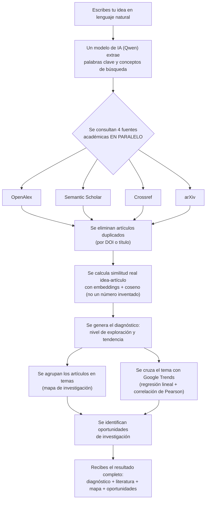

# ResearchLens

**ResearchLens** convierte una idea de investigación escrita en lenguaje natural en un diagnóstico
fundamentado: busca literatura científica real en cuatro fuentes académicas al mismo tiempo, calcula
qué tan parecida es tu idea a lo que ya existe, te muestra qué tan explorado está el tema y te sugiere
posibles oportunidades de investigación — todo en una sola búsqueda, sin tener que abrir cuatro pestañas
distintas.

Es un proyecto académico desarrollado por **Cristian Miguel Peñata Andrades**, estudiante de Tecnología
e Informática de la **Universidad de Córdoba** (Colombia), vinculado al grupo de investigación
**EDUTLAN**.

> Si nunca has usado un proyecto como este, no te preocupes: este documento explica todo paso a paso,
> desde qué es cada cosa hasta cómo instalarlo y usarlo, sin dar nada por sabido.

---

## Tabla de contenido

1. [¿Qué puedes hacer con ResearchLens?](#qué-puedes-hacer-con-researchlens)
2. [¿Cómo funciona por dentro?](#cómo-funciona-por-dentro)
3. [Tecnologías utilizadas](#tecnologías-utilizadas)
4. [Estructura del proyecto](#estructura-del-proyecto)
5. [Requisitos previos](#requisitos-previos)
6. [Instalación y ejecución](#instalación-y-ejecución)
   - [Opción A: con Docker (la más sencilla)](#opción-a-con-docker-la-más-sencilla)
   - [Opción B: manual, con Node.js](#opción-b-manual-con-nodejs)
7. [Variables de entorno](#variables-de-entorno)
8. [Guía de uso paso a paso](#guía-de-uso-paso-a-paso)
9. [Límites de uso](#límites-de-uso)
10. [Privacidad y seguridad](#privacidad-y-seguridad)
11. [Créditos](#créditos)
12. [Licencia](#licencia)

---

## ¿Qué puedes hacer con ResearchLens?

- **Escribir tu idea con tus propias palabras.** No necesitas saber redactar una pregunta de
  investigación formal; ResearchLens la interpreta y la convierte en términos de búsqueda efectivos.
- **Ver un diagnóstico de qué tan explorado está tu tema**: bajo, moderado o alto, con una explicación
  en español y una tendencia (creciente, estable o decreciente) basada en publicaciones reales por año.
- **Explorar literatura real** recuperada de cuatro fuentes académicas a la vez: **OpenAlex**,
  **Semantic Scholar**, **Crossref** y **arXiv**.
- **Ver qué tan parecido es cada artículo a tu idea**, calculado con inteligencia artificial
  (comparación semántica real, no una cifra inventada), junto con una explicación de en qué se parece y
  en qué se diferencia (población, contexto, variable).
- **Ver un mapa visual de los temas relacionados** con tu idea: cada círculo es un tema, su tamaño
  indica cuántos estudios existen y su color indica qué tan concentrada está la investigación en él.
- **Comparar el interés público (Google Trends) contra las publicaciones académicas** del mismo tema,
  con un cálculo estadístico real (regresión lineal y correlación), no solo una opinión generada por IA.
- **Descubrir posibles oportunidades de investigación**: vacíos poco explorados, zonas parcialmente
  cubiertas o ángulos donde tu idea podría diferenciarse.
- **Refinar tu pregunta de investigación**: llenas un formulario corto (población, contexto,
  intervención, variable de resultado, geografía, tipo de estudio) y recibes 3 propuestas de pregunta
  ya delimitadas, con una calificación de claridad, delimitación, literatura disponible y diferenciación.
- **Ver videos de YouTube relacionados** con tu tema, para complementar la lectura — con un filtro
  automático que descarta videos que no tienen nada que ver con tu búsqueda (sin gastar IA para eso, solo
  comparando palabras clave).
- **Guardar tu progreso como un proyecto** y continuarlo más tarde, con su propio historial de cambios.
- **Consultar tu historial de búsquedas** y volver a abrir cualquier análisis anterior exactamente como
  quedó guardado (sin que se mezcle con una búsqueda más reciente).
- **Preguntarle a un asistente de IA** sobre los artículos que ya se encontraron para tu idea: responde
  solo con información real de esos artículos y cita sus fuentes; si no tiene información suficiente, te
  lo dice en vez de inventar una respuesta.
- **Tener tu propia cuenta**, con inicio de sesión seguro (contraseñas cifradas, sesión con token JWT), o
  entrar directamente con **Google, Microsoft, Facebook, Apple o GitHub** (vía Clerk) si no quieres crear
  otra contraseña más.

---

## ¿Cómo funciona por dentro?

Cuando escribes una idea y le das a "Analizar idea", ocurre lo siguiente (todo en el servidor, tu
navegador nunca habla directamente con estos servicios):



Algunos detalles importantes de cómo está construido esto:

- **Ninguna fuente puede tumbar el análisis.** Si una fuente falla (por ejemplo, Semantic Scholar
  responde "demasiadas solicitudes"), ResearchLens espera lo necesario y reintenta con pausas cada vez
  más largas; si aun así no responde, el resto del análisis continúa igual con las fuentes que sí
  funcionaron, y te lo indica en el panel de "Fuentes consultadas".
- **La similitud es matemática, no una opinión.** Se convierte tu idea y cada resumen de artículo en
  vectores numéricos (embeddings) y se mide qué tan cerca están entre sí (similitud coseno). La IA
  generativa solo se usa para explicar en palabras esa cifra, no para inventarla.
- **Cada búsqueda queda guardada por separado.** Cuando abres una búsqueda anterior desde tu historial,
  se reemplaza todo el estado de la pantalla de una vez (diagnóstico, artículos, temas, oportunidades),
  así que nunca ves una mezcla de dos búsquedas distintas.
- **La IA razona como un investigador senior, no como un asistente genérico.** Los prompts que deciden
  hacia dónde orientar la investigación (oportunidades, delimitación, preguntas, diagnóstico) le piden a
  Qwen que asuma el criterio de alguien con experiencia dirigiendo líneas de investigación y evaluando
  artículos como par académico: prioriza rigor metodológico y viabilidad real, y nunca rellena huecos de
  evidencia con inventos.
- **Los videos relacionados se filtran localmente, sin gastar tokens de IA.** Se compara el título y
  canal de cada video contra las palabras clave de tu búsqueda; si no comparten nada relevante, se
  descarta antes de mostrarse.

---

## Tecnologías utilizadas

**Frontend** (lo que ves en el navegador):

| Tecnología | Para qué se usa |
|---|---|
| [React 19](https://react.dev/) + [TypeScript](https://www.typescriptlang.org/) | Interfaz de usuario |
| [Vite](https://vitejs.dev/) | Servidor de desarrollo y empaquetado |
| [React Router](https://reactrouter.com/) | Navegación entre pantallas |
| [Tailwind CSS v4](https://tailwindcss.com/) | Estilos y sistema de diseño |
| [Framer Motion](https://motion.dev/) | Animaciones e interacciones |
| [Recharts](https://recharts.org/) | Gráficas (tendencias, interés público, uso) |
| [Lucide](https://lucide.dev/) | Íconos |
| [Clerk](https://clerk.com/) (`@clerk/clerk-react`) | Login social con Google, Microsoft, Facebook, Apple y GitHub |

**Backend** (el servidor que hace el trabajo pesado):

| Tecnología | Para qué se usa |
|---|---|
| [Node.js](https://nodejs.org/) + [Express](https://expressjs.com/) + TypeScript | API REST |
| [PostgreSQL](https://www.postgresql.org/) (probado con [Neon](https://neon.tech/)) | Guardar usuarios, proyectos, búsquedas e historial |
| [JWT](https://jwt.io/) + [bcrypt](https://www.npmjs.com/package/bcryptjs) | Autenticación y contraseñas cifradas |
| [Clerk](https://clerk.com/) (`@clerk/backend`) | Verifica la sesión de login social y la vincula a la cuenta en Postgres (Clerk solo resuelve el OAuth; la sesión real sigue siendo el JWT propio) |
| [Helmet](https://helmetjs.github.io/) | Cabeceras HTTP de seguridad (protección contra XSS, sniffing, clickjacking) |
| [express-rate-limit](https://www.npmjs.com/package/express-rate-limit) | Límite de intentos de login/registro por IP, contra ataques de fuerza bruta |

**Servicios externos que consulta el backend:**

| Servicio | Para qué |
|---|---|
| [Qwen](https://www.alibabacloud.com/en/product/modelstudio) (Alibaba Cloud) | Extracción de conceptos, diagnóstico, comparaciones, oportunidades, refinamiento de preguntas, embeddings y el asistente de chat |
| [OpenAlex](https://openalex.org/) | Fuente principal de literatura, conteos y tendencias por año/tema |
| [Semantic Scholar](https://www.semanticscholar.org/product/api) | Fuente complementaria de literatura |
| [Crossref](https://www.crossref.org/) | Fuente complementaria de literatura |
| [arXiv](https://arxiv.org/) | Preprints recientes |
| Google Trends (vía el paquete no oficial `google-trends-api`) | Interés de búsqueda público |
| [YouTube Data API v3](https://developers.google.com/youtube/v3) | Videos relacionados |

---

## Estructura del proyecto

```
proyectodatos/
├── src/                    # Frontend (React + Vite)
│   ├── pages/               # Cada pantalla de la app (Inicio, Mi idea, Resultados, Historial, ...)
│   ├── components/          # Piezas reutilizables (tarjetas, gráficas, formularios, layout)
│   ├── hooks/                # Estado compartido (sesión de investigación, autenticación, proyectos)
│   ├── services/             # Llamadas al backend
│   └── types/                 # Tipos de TypeScript
├── server/                 # Backend (Node/Express)
│   └── src/
│       ├── pipeline/          # El "cerebro" del análisis (búsqueda, similitud, diagnóstico, temas, oportunidades)
│       ├── lib/                # Clientes de cada servicio externo (Qwen, OpenAlex, arXiv, Google Trends, ...)
│       ├── routes/             # Endpoints de la API
│       └── db/                  # Acceso a Postgres
├── public/                 # Archivos estáticos (imágenes, íconos)
├── docker/                 # Configuración de nginx para el contenedor
├── Dockerfile               # Imagen única (frontend + backend)
└── docker-compose.yml      # Levanta todo con un solo comando
```

---

## Requisitos previos

Necesitas **una** de estas dos cosas (no ambas):

- **[Docker Desktop](https://www.docker.com/products/docker-desktop/)** instalado — es la forma más
  simple, no necesitas instalar Node.js ni nada más. *(Opción A)*
- **[Node.js](https://nodejs.org/) versión 22 o superior** — si prefieres correr el proyecto
  directamente en tu computador para poder modificarlo. *(Opción B)*

En ambos casos también necesitas:

- Una base de datos **PostgreSQL**. La forma más fácil de conseguir una gratis es crear una cuenta en
  [neon.tech](https://neon.tech/) (no requiere tarjeta de crédito para el plan gratuito) y copiar la
  cadena de conexión que te dan.
- Al menos la clave de **Qwen** (para que el análisis funcione) — sin las demás claves (OpenAlex,
  Semantic Scholar, YouTube, etc.) igual funciona, solo con menos fuentes o funciones "bonus".
- *(Opcional)* Una cuenta gratis en [Clerk](https://dashboard.clerk.com/) si quieres habilitar los
  botones de "Continuar con Google/Microsoft/Facebook/Apple/GitHub" — sin esto, el login normal con
  correo y contraseña funciona igual.

---

## Instalación y ejecución

### Opción A: con Docker (la más sencilla)

Docker empaqueta todo (frontend + backend) en un solo contenedor, así que no tienes que instalar Node,
configurar dos servidores por separado, ni preocuparte por versiones.

1. **Instala Docker Desktop** (si no lo tienes): [docker.com/products/docker-desktop](https://www.docker.com/products/docker-desktop/)
   y ábrelo (déjalo corriendo en segundo plano).
2. **Abre una terminal** en la carpeta del proyecto.
   - En Windows: clic derecho dentro de la carpeta → "Abrir en Terminal" (o `Shift + clic derecho` →
     "Abrir ventana de PowerShell aquí").
   - En Mac: abre la app "Terminal" y escribe `cd ` (con un espacio) y arrastra la carpeta del
     proyecto sobre la ventana, luego presiona Enter.
3. **Crea un archivo llamado `.env`** en la raíz del proyecto (junto a `package.json`) y complétalo con
   al menos `VITE_API_BASE_URL`, `QWEN_API_KEY`, `DATABASE_URL` y `JWT_SECRET` — ver la sección
   [Variables de entorno](#variables-de-entorno) para saber qué es cada una, cuáles son obligatorias y
   dónde conseguirlas.

   > Si vas a usar el login social (`VITE_CLERK_PUBLISHABLE_KEY`), ten en cuenta que Vite "hornea" esa
   > variable dentro del bundle **en el momento de construir la imagen**, no cuando el contenedor arranca
   > — por eso `docker-compose.yml` la pasa como *build arg*. Si cambias su valor, tienes que reconstruir
   > la imagen (`docker compose up --build`), no basta con reiniciar el contenedor.
4. **Levanta el proyecto:**

   ```bash
   docker compose up --build
   ```

   La primera vez tarda unos minutos porque descarga e instala todo. Cuando termine, verás mensajes de
   que el servidor está listo.
5. **Abre tu navegador** en [http://localhost:8080](http://localhost:8080). Ya puedes crear tu cuenta y
   usar ResearchLens.
6. Para apagarlo, vuelve a la terminal y presiona `Ctrl + C`, o corre `docker compose down` desde otra
   terminal en la misma carpeta.

### Opción B: manual, con Node.js

Esta opción corre el proyecto directamente con Node (un solo comando levanta frontend y backend a la
vez), ideal si vas a modificar el código.

1. **Instala Node.js 22 o superior** desde [nodejs.org](https://nodejs.org/) si no lo tienes.
2. **Abre una terminal** en la carpeta del proyecto (ver instrucciones en la Opción A, paso 2).
3. **Crea tu archivo `.env`** igual que en la Opción A (paso 3).
4. **Instala las dependencias del frontend:**

   ```bash
   npm install
   ```
5. **Instala las dependencias del backend:**

   ```bash
   npm run server:install
   ```
6. **Arranca todo con un solo comando** (frontend y backend juntos, cada uno con su propio color en la
   terminal para distinguirlos):

   ```bash
   npm run dev
   ```

   El backend queda escuchando en `http://localhost:8787` y Vite te va a mostrar la URL del frontend,
   normalmente `http://localhost:5173`. Si alguna vez necesitas correrlos por separado (por ejemplo para
   ver los logs de uno solo sin ruido del otro), puedes usar `npm run dev:client` o `npm run dev:server`.
7. **Abre esa URL en tu navegador.** Ya puedes crear tu cuenta y usar ResearchLens.
8. Para apagarlo, presiona `Ctrl + C` en la terminal (corta ambos procesos a la vez).

---

## Variables de entorno

Toda la configuración vive en un archivo `.env` que tú mismo creas en la raíz del proyecto, junto a
`package.json` (nunca lo subas a un repositorio público — ya está excluido en `.gitignore`). Cada línea
del archivo tiene la forma `NOMBRE_DE_LA_VARIABLE=valor`. Estas son todas las variables que reconoce
ResearchLens:

| Variable | Obligatoria | Para qué sirve | Dónde conseguirla |
|---|---|---|---|
| `VITE_API_BASE_URL` | Sí | URL donde el navegador encuentra al backend | Usa `http://localhost:8787/api` en desarrollo |
| `QWEN_API_KEY` | Sí | Motor de IA: diagnóstico, comparaciones, oportunidades, embeddings | [dashscope.console.aliyun.com](https://dashscope.console.aliyun.com/) |
| `DATABASE_URL` | Sí | Conexión a tu base de datos Postgres | Créala gratis en [neon.tech](https://neon.tech/) y copia la cadena de conexión |
| `JWT_SECRET` | Sí | Firma las sesiones de los usuarios; usa un texto largo y aleatorio | Generado por ti, ver comando abajo |
| `OPENALEX_MAILTO` | Recomendada | Correo de contacto para que OpenAlex priorice tus solicitudes | Tu propio correo |
| `OPENALEX_API_KEY` | No | Clave opcional de OpenAlex | [openalex.org](https://openalex.org/) |
| `CROSSREF_MAILTO` | Recomendada | Correo de contacto para Crossref | Tu propio correo |
| `SEMANTIC_SCHOLAR_API_KEY` | No | Sin ella funciona, pero con un límite de tasa más estricto | [semanticscholar.org/product/api](https://www.semanticscholar.org/product/api) |
| `YOUTUBE_API_KEY` | No | Sin ella, la sección de videos relacionados no funciona | [console.cloud.google.com](https://console.cloud.google.com/apis/credentials) (habilita "YouTube Data API v3") |
| `VITE_CLERK_PUBLISHABLE_KEY` | No | Habilita los botones "Continuar con Google/Microsoft/Facebook/Apple/GitHub". Sin ella, esos botones simplemente no aparecen y el login con correo/contraseña sigue funcionando igual | [dashboard.clerk.com](https://dashboard.clerk.com/) → tu app → "API Keys" |
| `CLERK_SECRET_KEY` | No (obligatoria solo si usas `VITE_CLERK_PUBLISHABLE_KEY`) | El backend la usa para verificar la sesión de Clerk antes de crear/vincular tu cuenta en Postgres | [dashboard.clerk.com](https://dashboard.clerk.com/) → tu app → "API Keys" |
| `DAILY_ANALYSIS_LIMIT` | No | Cuántos análisis puede correr cada usuario por día (por defecto 15) | — |
| `PORT` | No | Puerto del backend (por defecto 8787) | — |
| `JWT_EXPIRES_IN` | No | Duración de la sesión (por defecto `7d`, es decir 7 días) | — |
| `ARXIV_API_BASE_URL` | No | Endpoint de arXiv (por defecto ya viene configurado) | — |
| `DOAJ_API_BASE_URL` | No | Endpoint de DOAJ (por defecto ya viene configurado) | — |

Para generar un `JWT_SECRET` aleatorio y seguro, corre esto una sola vez en una terminal con Node.js
instalado y copia el resultado:

```bash
node -e "console.log(require('crypto').randomBytes(48).toString('hex'))"
```

---

## Guía de uso paso a paso

1. **Entra al sitio** y en la pantalla de bienvenida da clic en "Entrar a ResearchLens".
2. **Crea tu cuenta** (nombre, apellido, correo y contraseña de mínimo 8 caracteres), acepta los
   **términos y condiciones y la política de privacidad** (checkbox obligatorio) y da clic en "Crear
   cuenta y continuar" — o, si ya tienes una, cambia a la pestaña "Iniciar sesión". Si el proyecto tiene
   configurado Clerk, también puedes entrar directamente con **Google, Microsoft, Facebook, Apple o
   GitHub**, sin llenar el formulario.
3. En "Inicio", da clic en **"Analizar mi idea"**.
4. **Escribe tu idea de investigación** con tus propias palabras (mínimo 15 caracteres) y qué quieres
   lograr con ella. Opcionalmente puedes abrir "Detalles opcionales" y agregar área, población, contexto
   o variable.
5. Da clic en **"Analizar idea"** y espera unos segundos mientras ResearchLens hace todo el proceso
   descrito en [¿Cómo funciona por dentro?](#cómo-funciona-por-dentro).
6. Verás tu **diagnóstico**: qué tan explorado está el tema, similitud promedio con la literatura
   encontrada y la tendencia de publicaciones.
7. Desde ahí puedes ir a:
   - **Explorar literatura** — todos los artículos encontrados, con similitud calculada y comparación
     campo a campo contra tu idea.
   - **Mapa de investigación** — los temas relacionados, en forma de mapa visual, con su evolución de
     publicaciones por año.
   - **Oportunidades** — posibles vacíos o ángulos de diferenciación para tu propuesta.
8. Si quieres, ve a **"Construye una mejor pregunta"** para refinar tu idea en una pregunta de
   investigación bien delimitada, con 3 propuestas calificadas.
9. Da clic en **"Guardar proyecto actual"** (en "Mis proyectos") para no perder tu progreso. Puedes
   volver a él cuando quieras, y también eliminarlo si ya no lo necesitas.
10. En **"Mi historial"** puedes ver todas tus búsquedas anteriores y abrir cualquiera de ellas para
    revisarla de nuevo, tal como quedó.
11. Usa el botón flotante **"Preguntar al asistente"** (abajo a la derecha) para hacerle preguntas
    directas sobre los artículos que ya se encontraron para tu búsqueda actual.

---

## Límites de uso

Para evitar que una sola cuenta agote el saldo de la IA, cada usuario tiene un tope de análisis
completos por día (**15 por defecto**, configurable con `DAILY_ANALYSIS_LIMIT`). El contador se reinicia
todos los días a medianoche (UTC) y puedes ver cuántos te quedan en la sección "Mi historial".

---

## Privacidad y seguridad

- El **frontend nunca contiene claves de API**: todas las llamadas a Qwen, OpenAlex, Semantic Scholar,
  Crossref, arXiv, Google Trends y YouTube se hacen siempre desde el backend.
- Lo único que el navegador guarda es tu **sesión (token JWT)**, en el almacenamiento local del
  navegador.
- Las **contraseñas se guardan cifradas** (bcrypt), nunca en texto plano. Si entras con Google,
  Microsoft, Facebook, Apple o GitHub, ese paso lo resuelve **Clerk**: ResearchLens nunca ve ni guarda la
  contraseña de esa cuenta externa, solo tu nombre y correo para identificarte.
- El servidor **limita cuántos intentos de login/registro** puede hacer una misma IP en pocos minutos
  ([express-rate-limit](https://www.npmjs.com/package/express-rate-limit)), para dificultar ataques de
  fuerza bruta.
- Se usan **cabeceras HTTP de seguridad** ([Helmet](https://helmetjs.github.io/)) contra ataques comunes
  como XSS o sniffing de contenido.
- Toda cuenta nueva debe **aceptar explícitamente los términos y condiciones y la política de
  privacidad** (checkbox obligatorio en el registro) antes de poder crear la cuenta.
- Cada usuario solo puede ver y modificar **sus propios** proyectos, búsquedas y mensajes.
- Si escribes una URL que no existe, ResearchLens muestra una **página 404** en vez de un error en blanco,
  y las pantallas muestran un indicador de carga mientras esperan una respuesta lenta del servidor.

---

## Créditos

- Gracias especiales a **[Semantic Scholar](https://www.semanticscholar.org/product/api)** por el
  acceso a su API para este proyecto.
- Proyecto desarrollado en el marco del grupo de investigación **EDUTLAN**, Universidad de Córdoba
  (Colombia).

---

## Licencia

Este proyecto está bajo la licencia **MIT** — puedes usarlo, copiarlo, modificarlo y distribuirlo
libremente, incluso con fines comerciales, siempre y cuando mantengas el aviso de copyright original.
Ver el archivo [LICENSE](LICENSE) para el texto completo.

Copyright (c) 2026 **Cristian Miguel Peñata Andrades**
